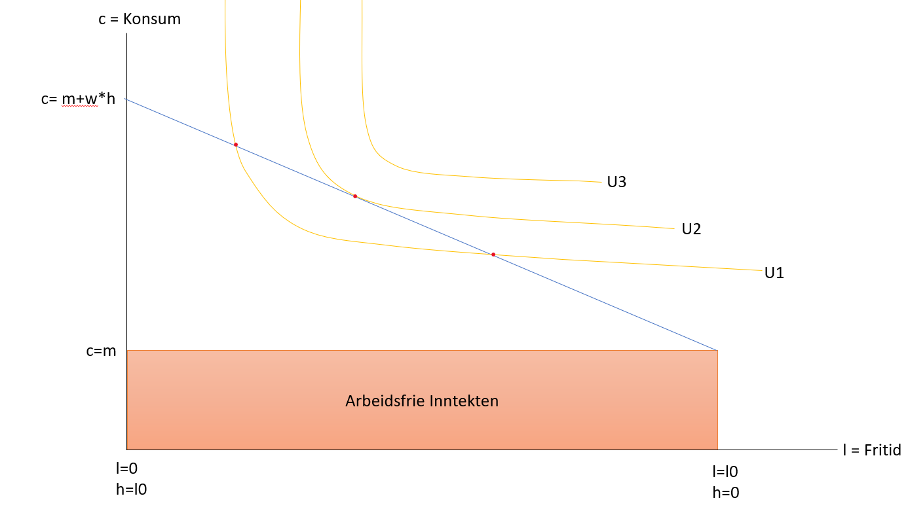
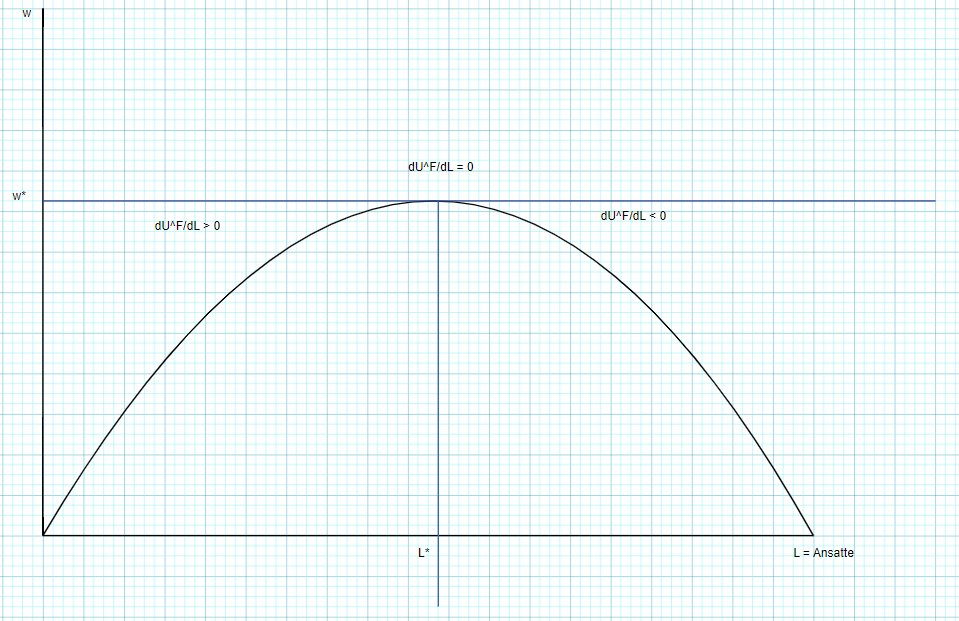

```{r, warning = FALSE, echo = FALSE, include=FALSE}
library(readxl) 
library(ineq)
library(httr)
library(rjstat)
library(gdata)
library(lubridate)
library(janitor)
library(PxWebApiData)
library(dplyr)
library(ggplot2)
library(gglorenz)
library(png)
library(readr)
library(gridExtra)

```

#Utfordring 2.1

1.) Ole i gata får nytte av konsum av et sammensatt gode (c) og fritid (l). Nyttefunksjonen er altså gitt av U(c,l). Ole kan fritt velge hvor mange timer (h) han jobber, men han kan ikke påvirke timelønna sin. Han har en reallønn tilsvarende w kr per arbeidstime. Vis Ole ikke jobber i det hele tatt (l=l0) må han leve på sin arbeidsfrie inntekt, m. Definer Ole sin reservasjonslønn. Illustrer grafisk og gi økonomisk intuisjon.

Svar:
Jobb timer(han bestemmer selv) = h 
konsum = c =  m + w* h  
fritid = l 
Nyttefunksjonen = U(c,l)
reallønn = w 
Ingen jobb (l = l0)
Arbeidsfrie inntekt = m

Ole sin reallønn er w og med bruk av formelen for konsum $c = m + w * h$ så får vi vår nyttefunksjon. der denne krysser inndiffreanse kurvene på nyttefunksjonen
finner vi reservasjonslønnen som ligger på disse skjeringspunktene, disse punktene gir samme nytte for Ole som om han ikke skulle ha jobbet.


```{r 211, out.width = "90%"}



```


2.)

Anta at Ole initialt har en timelønn $w_0>w_r$  og at han får en lønnsøkning til $w_1>w_0$. Forklar hvordan dette påvirker Oles optimale valg av arbeidstimer. Illustrer grafisk, identifiser inntekts og subsitusjonseffekter, og gi økonomisk intuisjon.    

Svar:

```{r 212, out.width = "80%"}

knitr::include_graphics("211graf3.PNG")


```

Når $w1>w0$ kommer det en substitusjonseffekt å dette ender med at Ole når ole må bestemme mellom D og C på grunn av den økte lønnen blir prisen på fritiden hans blir vært mer. Imens inntektsfunksjonen kommer av at Ole går fra punkt B til C der han får mer fritid og konsum en før på samme punkt som han skulle ha vært på U2.

3.)Den lille bedriften Skrei og sei (SOS) produserer sjømat ved bruk av fiskere (arbeid) og kapital (båter). Forklar hvordan et høyere lønnsnivå på fiskere (høyere pris på arbeid) påvirker SOS optimale valg av arbeid og nivå på produksjon på kort og lang sikt. Gi økonomisk intuisjon. 

Svar:

Kortsiktig så er K en konstant der alt bedriften kan gjøre for endringen i kostnader er å senke antall arbeidere. Dette er fordi når W går opp må $P*MP_L$ gå opp. Dette betyr at bedriften krever enda mer av vert enkel arbeider for å gjøre opp for arbeiderene som måtte bli sagt opp. Dette leder oss til konklusjonen på kortsikt med at antall arbeidere blir naturligvis senket når en høyere lønn blir plasert.


Men på langsikt så har de muligheten til å substituere arbeid mot kapital. Der selskapet kan investere penger i ny teknologi som kan erstatte tapt den tapte arbeidskraften.


så får vi dpi/dl blir positiv til w = (df(l,k))/dl så blir w større en hva (df(l,k))/dl og det blir mindre profittabelt å ha flere arbeidere

#Utfordring 2.2

Anta at markedets etterspørsel på arbeid er gitt ved W=120-0.02L, der w er lik timelønna og L er antall sysselsatte. Anta videre at alle arbeidere er organisert i en fagforening. Fagforeningen sitt mål er å maksimere den summerte nytten blant medlemmene. Anta at vi kan definere fagforeningens nyttefunksjon UF=(W-WR)*L, der wr = 50 er reservasjonslønna som vi antar er konstant. Anta at fagforeningen har full makt å sette enten lønna eller sysselsetting. Fagforeningen kan dog ikke bestemme både lønn OG sysselsetting.

Utled matematisk, illustrer grafisk og gi økonomisk intuisjon til den optimale lønna som denne fagforening vil sette og hvilke konsekvenser dette får sammenlignet med en situasjon uten en fagforening med monopol.


Svar:

Vi har en etterspørel på arbeid som er gitt som $w = 120 - 0.02*L$,
der w = Timelønn og L= antall ansatte. I tillegg tar vi tre antagelser:
1)antar at alle har lik  wr og lik produktivitet
2)arbeidere er risiko nøytrale.
3)fagforeningen har monopol og kan sette enten lønna eller sysselsetting.

Fagforeningen vår sitt mål er å maksimere nytten blant medlemmene og dette definerest som 
Nyttefunksjon vår $U^F = (w-w^r)*L$ og 
$w^r = 50$ er reservasjonslønnen.
Dette gir oss stykket
$U^F = (120-0.02*L - 50)*L$
hvor vi deriverer dette ender vi med $duf/dL$

```{r bilde3, out.width="95%"}


```
som vis er fra grafen for å nå den optimale valget for fagforeningen må vi løse
$duf/dL = 0$
Med å derivere $U^F$ ender vi med
$120-0.04L - w^r = 0$
Vi flytter 0.04L Over til 0 og deler det på 0.04.
$120-50/0.04 = 0.04L/0.04$
Så ender vi med tallet på antall ansatte
L* = $(120-50)/0.04 = 1750$
1750 ansatte.
Vi deretter bruker dette for å løse ut W for å få
W* = $120-0.02*1750$ = 85
som blir hvor mye de får pr ansatte

imotsetning i en situasjon hvor de ikke har monopol vil vi ende opp med en situasjon der arbeidstaker kan bestemme både lønn og antall der mangelen kan lede til mindre preferable situasjoner for arbeidstakere og lavere lønn en vis fagforeningen hadde monopol. Men en konsekvens av dette er at arbeidsgiveren kan ta flere ansatte som en konsekvens av en lavere lønn på arbeideren.


#Utfordring 2.3

Datasetet union_unempl.csv inneholder data over arbeidsledighet (unempl) i prosent, fagforeningsdensitet (density), koordinering av lønnsfastsettelse (coord), nivå på forhandlinger (level), og hvor stor andel av arbeidskraften som dekkes av kollektive forhandlinger (coverage) for land i Europa. Data om fagforeninger kommer fra oecd.org. Data på arbeidsledighet kommer fra Eurostat. Vi bruker datasetet “lfsa_urgan”.

I den her oppgaven ønsker vi at du skal visualisere data ved bruk av kart. Du finner en tutorial til hvordan du går fram i denne youtube-filmen. Du får også støtte fra denne R-koden

Lag kart over Europa som viser 1) arbeidsledighetsrate i ulike land.
Lag kart over Europa som viser 1) fagforeningsdensitet, 3) “Excess coverage”, og 3) Koordinering av lønnsfastsettelse.
Diskuter det du ser i dine grafer ut ifra kapittel 3 i Boeri og van Ours. Kommenter hvordan det kan komme seg at de nordiske landene har sterke fagforeninger og relativt lav arbeidsledighet.


```{r maps, include = FALSE}
union<- read_csv("union_unempl.csv")

union$country <- gsub("United Kingdom", "UK", union$country)
View(union) 


# Renaming a variable. The below code renames the variable "Country" to "Region".
names(union)[names(union) == "country"] <- "region"
View(union) 

mapdata <- map_data("world")
View(mapdata)


union$excesscoverage<-union$coverage- union$density


mapdata <- left_join(mapdata, union, by = "region")

mapdata2<- mapdata %>% 
  filter(!is.na(mapdata$mean_unempl2015_2019))

map1 <- ggplot(mapdata2, aes(x = long, y = lat, group=group)) + 
  geom_polygon(aes(fill = unempl), color = "black")


unemplmap <- map1 + scale_fill_gradient(name = "% Unemployed", low = "yellow", high = "red", na.value = "gray50")+
  theme(axis.text.x = element_blank(),
        axis.text.y = element_blank(),
        axis.ticks = element_blank(),
        axis.title.y = element_blank(),
        axis.title.x = element_blank())


map1.1 <- ggplot(mapdata2, aes(x = long, y = lat, group=group,)) + 
  geom_polygon(aes(fill = mean_unempl2015_2019), color = "black")


map2 <- ggplot(mapdata2, aes(x = long, y = lat, group=group))+
  geom_polygon(aes(fill = excesscoverage,shape = coord), color = "black")


excessmap <- map2+ scale_fill_gradient(name = "% Excess coverage", low = "red", high = "green", na.value = "gray50") +
  theme(axis.text.x = element_blank(),
        axis.text.y = element_blank(),
        axis.ticks = element_blank(),
        axis.title.y = element_blank(),
        axis.title.x = element_blank()) + 
  labs(title = "fagforeningens overflødig tetthet kart")

map3 <- ggplot(mapdata2, aes(x = long, y = lat, group=group)) + 
  geom_polygon(aes(fill = coord), color = "black") +
  scale_fill_brewer(name="koordinering av lønnsfastsettelse", palette = "Set3")+
  theme(axis.text.x = element_blank(),
        axis.text.y = element_blank(),
        axis.ticks = element_blank(),
        axis.title.y = element_blank(),
        axis.title.x = element_blank()) + 
  labs(title = "")


map4 <- ggplot(mapdata2, aes(x = long, y = lat, group=group)) + 
  geom_polygon(aes(fill = density, shape = coord), color = "black")


densitymap <- map4+ scale_fill_gradient(name = "% Density", low = "red", high = "green", na.value = "gray50")  +
  theme(axis.text.x = element_blank(),
        axis.text.y = element_blank(),
        axis.ticks = element_blank(),
        axis.title.y = element_blank(),
        axis.title.x = element_blank()) + 
  labs(title = "Density kart") 


```
Svar:


```{r unemplyment map}
unemplmap
```

Vi observerer at de nordiske landene har veldig lav arbeidsledighet hvor den ser ut til å bli øket jo lavere vi
kommer på kartet.


```{r density}
densitymap
```
Vi observerer at landene sin fagforeningensdensiteten blir høyere jo mer nord vi kommer. og denisty dette viser oss hvor mange som er medlemmer i fagforeningen


```{r excess}
excessmap

```

Her ser vi at flere land ikke har data for fagforeningens overflødighet, der flere av de østlige og nordiske landene har mindre overflødighet i landet ulikt sørvest på kartet hvor vi ser en veldig stor overflødighet. Der dette står for antall prosent som får samme fordeler som medlemmer men uten å være i det.


```{r kordingering}
map3
```

Vi observerer at flere at de nordiske landene har koordineringer som er 4/3 og dette gjennvisest tidligere med at de har flere medlemmer og mindre arbeidsledighet i forhold til resten av europa. Dette kan være på grunn av modellen de bruker, denne modellen er den nordiske modellen går ut på at den bruker en trepartssamarbeid eller et topartssamarbeid.

Topartsamarbeids modellen består av arbeidsgiverorganisjonen og arbeidstakerorganisjonen, mens trepartssamarbeids modellen er den samme men staten er med. Disse partene hjelper de nordiske landene med å forsterke fagofreningener og senke arbeidsledighet.

Dette går ut på med hjelp av toparts/trepartssamarbeids modellene så jobber fagforeningen og arbeidsgivere sammen for å unngå ulemper og få frem felles vekst. Dette skjer med at lav produktivitets bedrifter som ikke klarer  å nå lønnsnivået som er satt. imens høy produktivitets bedrifter kan utnytte at de høyeste lønnsnivåene er relativt lave.
Det blir utnytta ny og effektive teknologier som forbedrer produktivitet der når markedet blir større kan flere få tak i bedre betalte jobber der nye eller flere arbeidsplasser kommer frem som en konsekvens.

Denne modellen funker bra selv om det er noen utfordringer som store gap i lønnsutviklinger mellom den offentlige og private sektoren i landet, der det har blitt en synkende koordinering.


i forhold til det som blir nevnt i kapittel 3 i boeri og van ours, der det er nevnt at flere land som italia, usa og UK har hatt en senkelse i fagoreningstettheten deres tidligere. 

