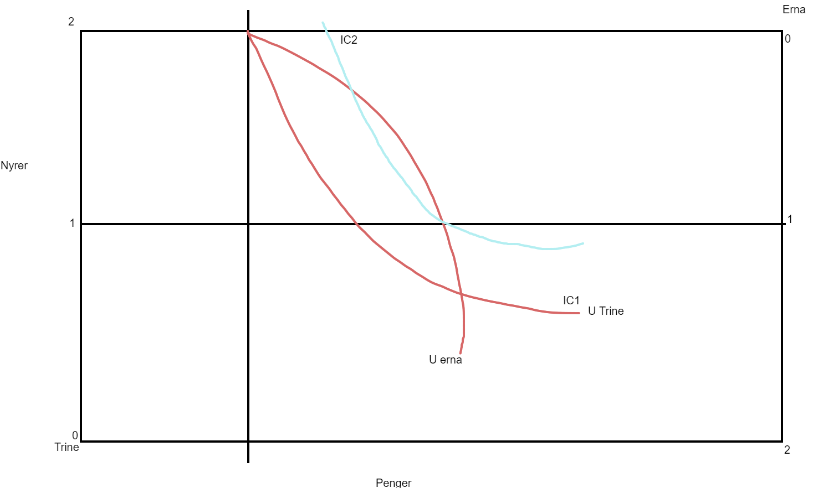

```{r, setup, warning = FALSE, echo = FALSE, include=FALSE}
library(readxl) 
library(ineq)
library(httr)
library(rjstat)
library(gdata)
library(lubridate)
library(janitor)
library(PxWebApiData)
library(dplyr)
library(ggplot2)
library(gglorenz)
library(png)
```

## Utfordring 1.1

1.) Hva mener vi med bidragsbaserte, behovsprøvde og universelle ordninger?

svar:

bidragbaserte: er hovedordninger som vi betaler bidrag til, dette er ting som helseforsikring der vi har betalt inn en skatt for å få tilbake igjenn vis noe skjer med oss.

Behovsprøvde: er hjelp som er basert på hvor mye vi har eller tjener dette er evt noe som NAV der de hjelper deg for å komme tilabke på beinene igjenn med at du ikke har noe inntekter når du er arbeidsløs

Universelle ordringer:  er en hovedordning som hjelper når du er i en vis situasjon alle kan komme innenfor som å bli pensjonist, så får du krav på en minstepensjon ellers så får du barnetrygd når du blir foreleder osv lingende ting.


2.) Gjør rede for begrepene vertikal og horisontal omfordeling (side 12 i læreboken). Når kan det være akuelt med horisontal omfordeling?

Svar: 

vertikal omfordelinger basert på : er at vi fordeler uten å tenke på hvor mye ressurser de har tilgang til, Dette går ut på at eventuelt det at du betaler skatt med tanke på hvor mye du tjener inn.

Horisontal omfordeling: er at vi fordeler inntekter med å betale for universielle ordninger, dette er at vi betaler en fast skatt der vi betaler offentlige tjenester som skole, helsetrygd, barnefamilier osv. Dette ender med at de som trenger denne støtten får det, og det er noe alle har rettigheter.

Det kan være aktuelt med en horsiontal omfordeling foreksempel i arbeidsplassen der det kan være en veldig skeiv fordeling av jobber i høyere stillinger i arbeidsplasser der det er en veldig skeiv mannlig ledelse.


3.) Drøft ulike teorier om sosial rettferdighet. Gjør spesielt rede for maximin-prinsippet til John Rawls.

Svar: 

Rowls i hans teorier og meninger om sosial rettferdighet at, han vil ha rettferdige fordelinger i ressusene til staten, men at fokuset først og fremst på individuell frihet. Den individuelle friheten han snakker om går ut på alle de mennesklige rettighetene, som  ytringsfrihet, religionsfrihet, og beskyttelse av loven osv. Måten han mener at fordelingen skal skje er med i bruk av maximin prinsippet, der vi fordeler resussene til staten slik at vi  maximerer positionen til dens om er dårligstillt i samfunnet. 

oppimot de natural-rights-libertarians så har deres teorien om samfunnet hvor det du får i belønning fra dit arbeid er ditt aleine. hvor individ rettighetene går ut på at et individ har krav på å arve en eiendom, gjennom opptjening og eiendommer som 
ikke faller underdette har man ikke rettigheter for. hvor natural-rights-libertarians ser mer på det matrielle imens Rowls ser 
på det som er mer hoved rettigheter.


4.) Diskuter om det finnes noen ulemper ved å eliminere all ulikhet i samfunnet.

Svar:  

Konsekvense av å eliminiere ulikhet i samfunnet, er at vi ender med flere situasjoner der det blir en negativ utviklinger for samfunnet, Der det leder til et dårligere kvalitet oppover i systemet, dette kan hende pga en lik lønn på alle jobber som leder til midnre initiativ til å ha en høyere og mer viktig jobb, eller det at alle har lik rettighet til å søke på jobben å at folk som ikke er kvalifiserte får den. andre ulemper er innenfor helsesektoren, med ingen ulikhet så har alle passienter lik prioritering der en forskjølelse har like mye krav på en doktor som noen i livsfare. blir også problemer for selskaper som skal selge ting, skal de betale like mye som et nytt selskap eller skal nye selskap betale samme priser som et selskap som coca cola.

Det blir også en svikt i motivasjon blant samfunnet der det blir samme lønn på alle jobber, imens dette hørest bra ut er dette en
ulempe med at det blir en svikt i motivasjon til å jobbe en vanskligere jobb sammenlignet med en enklere. 


## Utfordring 1.2

1.) Forklar kort hva er en Paretoforbedring og hva som menes med Paretoeffektivitet, bytteeffektivitet, 
produksjonseffektivitet og sammensetningseffektivitet. Forklar også med egne ord hva 1. og 2. velferdsteorem sier.

Svar: 
  Bytteeffektivitet: Hvordan vi maksimerer nytten mellom to personer.
  
  Produskjonseffektivitet: Hvodan du produserer mest mulig for minst mulig.
  
  Sammensetningseffektivitet: Handler om supply and demand, Der vi lager hva
    Er der man finner ut av hva som skal lagest, og hvor mye av dette.
  
  Paretoeffektivitet: Er når vi har oppfyllt de tre kravene Bytteeffektivitet, produksjonseffektivitet og sammensetningseffektivitet.

  Paretoforbedring : Er der vi kan forbedre en av kravene til paretoeffektiviteten uten å ha en negativ påvirkning på de andre kravene.

  

  Den første grunnlegende veldferdsteoremen sier at i et frittmarked så blir det naturlige valget, den beste varen innenfor
  den friekonkuransen til markedet og disse valgene vil føre til paretoeffektive allokeringer av ressurser.

  
  Den andre grunnleggende teoremen, forteller oss at i en først-best økonomi kan vi opnå en paretooptimal tilstand når vi omfordeler ressurser ved bruk av midler som lump-sum beskattning, en fast skatt som ikke kan endrest der vi fordeler det som blir betalt.


2.): For noen pasienter er organtransplantasjon det eneste gjenværende behandlingsalternativet.
Det er imidlertid en global mangel på organer som er tilgjengelige for transplantasjon. 
Organdonasjon fra friske frivillige og anskaffelse av donorkort oppfordres, mens den kommersielle organhandel er nesten universelt forbudt, 
unntatt i Iran. Vi antar at Trine har to friske nyrer, Erna har to sviktende nyrer,
og at det ikke finnes noen annen behandling for Erna enn en nyretransplantasjon. Tegn en Edgeworths
bytteboks som viser den opprinnelige ressursfordelingen for Trine og Erna. Tips: Sett “Antall friske nyrer” på y-aksen og «Penger» på x-aksen.
Diskuter om Trine og Erna ville få det bedre hvis den ene kunne selge og den andre kjøpe en nyre. Bruk bytteboksen videre til å vise hvordan 
legal handel med nyrer kan øke effektiviteten. Diskuter også etiske hensyn.
```{r edgeworth, echo=FALSE, fig.cap="", fig.retina=3, fig.height=4, fig.width = 3, fig.align='center'}


```


Der Erna og Trine sine indiffreanse(IC1) kurver krysser så får vi et punkt hvor vi har hvor trine og erna er enige om hvormye de vil betale. 
Dette ender med at trine sin indifferance kurven flytter seg som en konsekvens av et høyere nyttenivå(IC2). og gir oss en ny indifferanse kurve som krysser antall nyrer = 1. Dette gi oss punktet der vi får prisen på nyren blir satt til.

utifra dette vil både Erna og Trine vil få det bedre med salget og kjøpet når begge nådde den optimal bytteeffektive handelen i nyretransplantasjonen. Etisk er en nyretransplansjon ikke lovlig mange steder i verden blant folk som ikke er i slekt, dette leder til at salg og kjøp av organer som i dette tilfelle er moralsk grått. Dette er fordi at hvor setter man grensen når man først opner for organ markedet og hvordan setter man pris på dette.
Det er også tilfelle av at selv om det å integrere dette inn i samfunnet 


3):I hvilke av følgende markedene vil du forvente at markedet selv kunne oppnå en Paretoeffektiv løsning?
  Diskuter kort hvorfor (Tips: tenk på hvilke markedssvikt kan være til stede på markedet). Gi også eksempler på hvilke inngrep har 
det offentlige gjort for å bøte på eventuelle markedssvikt.

a) Markedet for helsetjenester:

Markedet vil ikke klart å holde seg selv parentoeffektiv, dette ville vært pågrunn av uten de statlige inngrepene så ender vi med
at helsetjenester vil være en stor forskjell på informasjon om det vi kjøper. Dette kommer av at kunden vil altid vite mindre
en offentlig lege, der kunden er altid vet mindre en selgeren. Der de statlige tiltakene krever
at leger har utdanning, godkjent autoritet, regulering osv. Uten dette ender det opp med at alle kundene i markedet
er i stor risikofare for uheldige utvalg. Dette leder til et markedsvikt der mangelen på å vite om at det du kjøper
effektivt løser problemstillingen du er i ender med en dårlig resursallokering hvor det heller ikke er bytteeffektivt, for samfunnet der du må kjøpe flere medisiner som du ikke vet kan løse din situasjon. Dette ender med at markedet ikke klarer og 
nå en paretoeffektiv tilstand uten de statlige hjelpe midlene.


b) Aksjemarked

Aksjemarkedet er som alle andre markeder, men her finner du få statlige inngrep som påkrevd kvartal rapport, som tillater investorer å vite hvordan det står til og om det er vært å forsette å investere eller ikke. Fjerner vi dette statlige inngrepet ender vi med at flere selskaper ikke viser aktuel data for hva som skjer som leder til uheldige handler og misbruk. Der selskap kan falsifisere eller velge å opplyse viktige tall og data som kan påvirke valg som investorer kan ta for optimale valg.
en paretoeffekt kan ikke realistik bli oppnådd når en mangel på informasjon vil lede til flere uoptimale valg, og allokeringer av ressuser i markedet blir investert hvor det ikke er optimalt.

Aksjemarkedet er et frittmarked der en paretoeffektiv fordeling vil mest sansynelig skje av at folk vil investere i lovende og profitt skapende aksjer. Dette vil lede til at et paretoeffektivt marked vil bli nådd der folk investerer i en pris der de tenker det vil tjene tilbake mer en de investerte. Dette leder til at produsenten av aksjen får mer budsjett der det kan få bedre resultater som leder til at det kan bli en økning i verdi som oppfyller sammensettningseffekten der supplyen(verdi) av askjene går opp imens demand(akjser) øker også jo bedre et selskap gjør det.

Et markeds svikt er noe som vil naturlig skje i et aksjemarked der aksjene kan tape all verdi, dette er hvor staten kan komme inn med en støtte som at lån som betalest tilbake etter x antall år slik at den som har mistet alt de har investert kan få mulighet til å komme tilbake igjenn på beina. Det finnest alt også lån for investering  i askjer som vi kan si er et inngrep staten der de låner penger ut for at de som investerer kan tjene mer å gå i pluss, itilegg med å betale tilbake skatten. eller at de bare ender opp med å måtte tilbake lånet til banken vis det går ille.

c) Studentlån

Vis vi har studentlån uten statlige inntak som at du må ha kommet inn på skolen, bestå semester, fullføre utdanningen osv
er statlige tiltak som har kommet for å sørge at studentlånet ikke blir misbrukt av dens om søker. og fjerner vi det så ender vi med at dette i et offentlig marked blir bare vanlige lån. Måter man måtte komme rundt dette for å få lån også måtte vært å ha noe som garanti for lånet. Dette ender med at vi får et marked som virker veldig ustabilt og har mange farer.


## Utfordring 1.3

1):Personen Per har et usikkert prosjekt som gir avkastning y = 4000 dersom det går dårlig og y = 12000 dersom det går bra. Begge utfallene har lik sannsynlighet. Nyttefunksjonen er gitt ved U(y) = y^0.5.

u(4000) = 4000*0.5

a) Er personen risikoavers?

svar: vis vi ender på en avkasting av 4000 eller 120000 ender vi med at Per er risikoavers uansett hvordan det går med hans prosjekt hans siden han ender med en positiv avkastning.

b) Finn forventa inntekt og forventa nytte fra prosjektet.

svar:
Vår forventede nytte blir 86.35, fordi vi har Ü = p1U(y1) + p2U(y2) der U(y) funksjonen vår er y^0.5
Så vi ender opp med Ü = 0.5*63.2 + 0.5*109,5 = 86.35 som er vår forventa nytte. p1 og p2 er 0.5 siden det er like stor sansynelighet det kan gå 
begge veier.

den forventede inntekten beregner vi som E(Y) = ÿ = p1y1 + p2y2.
dette blir ÿ= ^0.5*4000 + ^0.5 *12000
ÿ = 2000 + 6000 = 8000 så 8000 er vår forventede inntekt.

c) Hva er forsikringspremien? 

svar: Forsikringspremien ender på 7447.3 kr, Dette får vi med å gange vår forventede nytte(86.3) med seg selv siden 


|Inntekt, Forsikringspremie, og fordeler|Good Year|Bad Year|
|---------------------------------------|:-------:|-------:|
|1.Inntekter|12000|8000|
|2.Forskringspremie|7447|7447|
|3.Inntekts fordeler| 0| 8000|
|4.Netto inntekt(1-2+3)|4553|4553|
|5.Netto premie(2-4)|2894|2894|


2): For at en forsikringsordning skal fungere effektivt må noen forutsetninger være oppfylt. Diskuter disse forutsetningene. Vi ser på et privat forsikringsmarked for uførepensjon med to typer forsikringstakere. Den ene gruppen har lav sannsynlighet for at dårlig helse inntreffer (pL), mens den andre gruppen har høy sannsynlighet for at dårlig helse inntreffer (pH). Anta at forsikringsselskapet ikke kjenner de ulike individene sin sannsynlighet for dårlig helse.

Det trengst et marked og innenfor dette markedet er det potentielle farer for kundene selv for å være villig å skaffe seg
tjenesten som blir tilbudtav selskapet, disse kundene vil naturligvis være både pL og pH kunder der vi ikke har noen konkrete måter å vite hvem som er hvem. Dette leder til at forskringsordningen vil bruke to måter for og forhandle med disse kundene som er separerende likevekt, eller poolingløsning. Dette har en stor del at law of big numbers spiller en rolle i hvordan det funke der at du antar at noen vil ha ulykken men du har så mange kunder at det ikke har noe å si.   

a) Hva mener vi med en separerende likevekt?

Vi mener at selskapet tar en likevekt der de separerer mellom høy risiko kunder og lav risiko kunder der tilbudet blir valgt forskjellige basert hvilken type de er.

Anta at forsikringsselskapet ønsker å ta i bruk genetisk testing for å avsløre de ulike individenes sannsynlighet for dårlig helse.


b) Er dette en fordel eller ulempe for de to gruppene dersom vi har en stabil separerende likevekt?

Det er en ulempe for høy risiko grupper med at de altid ender opp med en dårligere avtale en de i en lav risiko gruppe, 
og en genetisk testing ender med en segrigering av grupper. Der vis folk har visse gener blir tvungen for en avtale for en høyrisiko gruppe selv om selve symptomet har en lav risiko. Mens for lav risiko gruppene vil en separerende likevekt ikke ha noen anderledes påvirkning for dem, siden de er fortsatt i den lav risiko gruppen.

c) Hva mener vi med en pooling-løsning? Er genetisk testing en fordel eller ulempe i denne situasjonen?

en ikke separerende likevekt der de gjør samme ting mot gruppen urelatert for hvem motakeren er, med en genetisk testing kan dette er en fordel for folk i en høy risiko gruppe, med at de får samme tilbud som alle andre for disse forsikringene baser på en gjennomsnittslig pris. Imens for en lav risiko vil det ikke være store endringer med at de er en mindre sjanse for at de vil kjøpe en i førsteplassen i tilleg med 

3): Forklar hva som menes med uheldig utvalg. Diskuter hvordan offentlig tvungen sosialforsikring, slik som Folketrygden, kan løse dette problemet

svar: det som menes med et uheldig utvalg er en differanse i informasjon, der forskjellen i informasjon leder til et uønsket valg som kunne blitt ungått.Dette valget er for både selger og kjøper. folketrygden kan løse dette problemet med at det er ingen svikt i informasjon mellom kjøper og selger med at dette er et påkrevd sosialforsikring som ikke tar kjøperens situasjon i kalkulasjon så det er ingen informasjons svikt. Dette hjelper også folk i risiko gruppene med å kunne få en forsikring.


4):Forklar hva som menes med adferdsrisiko. Diskuter hvordan offentlig tvungen sosialforsikring, slik som Folketrygden, kan løse dette problemet. Gi eksempler på adferdsrisiko, og hvordan myndighetene prøver å begrense dette problemet.

svar: ulikt uheldig utvalg blir vi ikke kvitt adferdsrisikoer, adferdsrisiko betyr at risikotakeren kan påvirke risikoen, der risokoen blir større som et resultat av forsikringen. Eksempel at vis du har en bilforsikring vil du kjøre mer uforsiktig en du ville uten, et annet eksempel er at du kan behandle et elektronisk aparat mer uforsiktig en du ville uten en forsikrings garanti på den vis den blir ødelagt. Tvungene sosialforsikringer som Folketrygden løser dette problemet med at så mange må betale at når det skjer ulykker så er det skjeldent nok til at det ikke har noe stor effekt på folketrygden tjener inn, Dette itilegg med at myndighetene 

5):Bruk denne R-koden til å lage et diagram med Gini-koeffisienter for de fire største nordiske landene og USA. Beskriv resultatene og diskuter kort årsaker til forskjellene i inntektsfordelingen du observerer i ditt diagram. Datafilen, som dere 
trenger, heter «GCIPrawdatatest.xlsx».
```{r, include=FALSE}
# Set your working directory to the correct folder.
# Insert your file path for 'YOURFILEPATH'.
#setwd("YOURFILEPATH")

decile_data <- read_excel("GCIPrawdatatest.xlsx", skip = 2)  

#The data is now in a 'tibble' (like a spreadsheet for R). Let's use the head function to look at the first few rows:
head(decile_data) 
#Now we use loops to complete our task. We begin by creating a new variable in our dataset, gini, which we initially set to 0 for all country-year combinations.
decile_data$gini <- 0
#Now we use a loop to run through all the rows in our dataset (country-year combinations). For each row we will repeat the Gini coefficient calculation from R walk-through 5.4 and save the resulting value in the gini variable we created.
#The function that calculates Gini coefficients from a vector of numbers is called Gini,and we apply it to the income deciles
# Give us the number of rows in decile_data
noc <- nrow(decile_data)

for (i in seq(1, noc)){
  # Go to Row I to get the decile data
  decs_i <- unlist(decile_data[i, 3:12])
  decile_data$gini[i] <- Gini(decs_i)
}
```

```{r, echo = FALSE, warning = FALSE}

#With this code, we calculated 4,799 Gini coefficients without having to manually run the same command 4,799 times. We now look at some summary measures for the gini variable.
#First we use the subset function to select Nordic countries and save their data as temp_data. As an example, we have chosen four anglophone countries: the UK, the US, Ireland, and Australia.
temp_data <- subset(
  decile_data, Country %in% c("United States","Sweden","Finland","Norway", 
                              "Denmark"))
#Now we plot the data using ggplot.

ggplot(temp_data, 
       aes(x = Year, y = gini, color = Country)) +
  geom_line(size = 1.5) +
  theme_bw() +
  ylab("Gini") +
  ggtitle("Gini coefficients for Nordic countries")

#This example is based on great webpages of CORE: https://www.core-econ.org/doing-economics/book/text/05-03.html#extension-r-walk-through-55-calculating-gini-coefficients-for-all-countries-and-all-years-using-a-loop. Take a look!


```

svar:

Vi ser i slutt resultatet at gini koeffienten til USA er mye større en i resten av skandinavia, der denne skillen kan komme av
at mange billionerer/millionerer bor i USA. Dette kan være fordi USA er et veldig kapitalistisk land som er på å skape mer penger
der de rike blir rikere. Dette leder til et stort skille i befolkningens inntekter. Vi observerer også at Svergie og Finland har hatt en økning i gini koeffienten deres de siste 3 årene.Norge har vi tidligere hatt en enorm vekst i gini der den hadde en brå stopp i veksten og vart senket veldig bratt, der den har fortsettet og synke siden da med noe få oppganger. 
Danmark har en nylig vekst men senket det siste året slik at det havner som nummer 2 blant lendene med mest gini koefficient forskjell.


6):Bruk R-pakken gglorenz til å tegne Lorenz-kurver for inntektsfodelingen i Tromsø kommune. Diskuter basert på figurene om ulikheten i byen har økt i tidsrommet 2005-2020? Du bruker denne koden til å hente dataene du trenger fra SSB.

```{r, echo=FALSE, warning=FALSE, }
Tabell <- "https://data.ssb.no/api/v0/no/table/12558/"

TabellJSON <- '{
  "query": [
    {
      "code": "Region",
      "selection": {
        "filter": "vs:Kommune",
        "values": [
          "5401",
          "1902"
        ]
      }
    },
    {
      "code": "InntektSkatt",
      "selection": {
        "filter": "item",
        "values": [
          "00"
        ]
      }
    },
    {
      "code": "ContentsCode",
      "selection": {
        "filter": "item",
        "values": [
          "VerdiDesil"
        ]
      }
    },
    {
      "code": "Tid",
      "selection": {
        "filter": "item",
        "values": [
          "2005",
          "2020"
        ]
      }
    }
  ],
  "response": {
    "format": "json-stat2"
  }
}'


tempdata <- POST(Tabell , body = TabellJSON, encode = "json", verbose())

Tabelldata <- fromJSONstat(content(tempdata, "text"))


Tromsøbase <- Tabelldata %>% 
  select(region,desil,år,value)


Troms2005 <- Tromsøbase %>% 
  filter(region != "Tromsø") %>% 
  filter(år == "2005")

Troms2020 <- Tromsøbase %>% 
  filter(region == "Tromsø") %>% 
  filter(år =="2020")

Tromsøbase %>%
  group_by(region) %>% 
  ggplot(aes(x=value, colour = region)) +
  stat_lorenz(desc = FALSE) +
  coord_fixed() +
  geom_abline(linetype = "dashed") +
  scale_x_continuous(labels = scales::percent) +
  scale_y_continuous(labels = scales::percent) +
  #annotate(geom="text", x=0.50, y=0.37, label="29.07%",
  #color="darkslategray", size = 2.5) +
  labs(x = "Total Inntekter i Tromsø i prosent",
       y = "Antall Personer i Tromsø i prosent",
       title = "Inntekter fordelt over befolkningen",
       caption = "https://data.ssb.no/api/v0/no/table/12558/") +
  theme_minimal()
```


Fra det vi kan observere har ulikheten i byen har økt, dette er fordi ginien til 2020 er større en 2005.
Dette lar oss vite at inntekts fordelingen i tromsø har blitt flytter bittelitt.