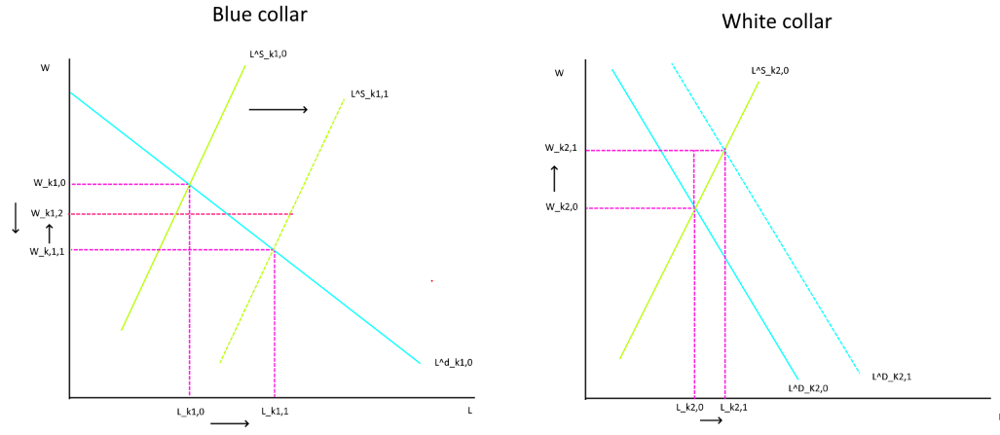
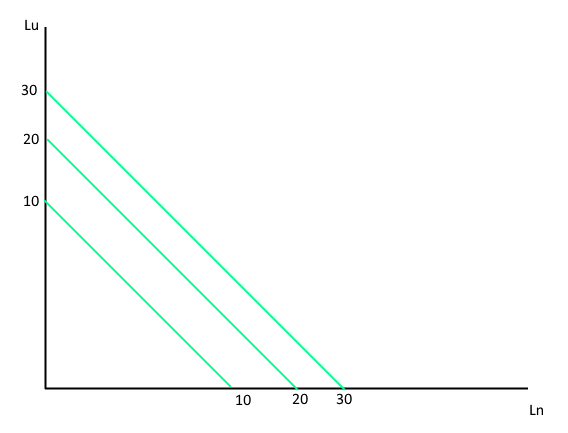
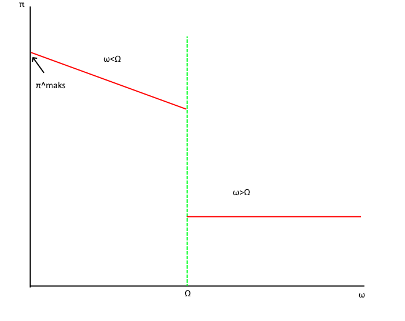

```{r setup, include=FALSE}

knitr::opts_chunk$set(echo = TRUE)
library(httr)
library(rjstat)
library(gdata)
library(lubridate)
library(janitor)
library (PxWebApiData)
library(dplyr)
library(ggplot2)
library(tidyr)

options(scipen=999)

```

```{r cars, include=FALSE}

innvandreretabell<-'https://data.ssb.no/api/v0/no/table/05185/'


TabellJSON <- '{
  "query": [
    {
      "code": "Kjonn",
      "selection": {
        "filter": "item",
        "values": [
          "1",
          "2"
        ]
      }
    },
    {
      "code": "Landbakgrunn",
      "selection": {
        "filter": "agg:Verdensdel2",
        "values": [
          "b0",
          "b11",
          "b12",
          "b13",
          "b14",
          "b2",
          "b3",
          "b4",
          "b5",
          "b6",
          "b8",
          "b9"
        ]
      }
    },
    {
      "code": "Tid",
      "selection": {
        "filter": "item",
        "values": [
          "2005",
          "2006",
          "2007",
          "2008",
          "2009",
          "2010",
          "2011",
          "2012",
          "2013",
          "2014",
          "2015",
          "2016",
          "2017",
          "2018",
          "2019",
          "2020",
          "2021",
          "2022"
        ]
      }
    }
  ],
  "response": {
    "format": "json-stat2"
  }
}'


tempdata <- POST(innvandreretabell , body = TabellJSON, encode = "json", verbose())

Tabelldata <- fromJSONstat(content(tempdata, "text"))

as_tibble(Tabelldata)

Tabelldata


Innvandrere <- Tabelldata   %>% 
  pivot_wider(names_from = kjønn, values_from = value )


Innvandrere <- Innvandrere%>%
  mutate(TotallPersoner  = Menn+Kvinner)

```

## Oppgave 5.1.1

Hent data om landbakgrunn for innvandrere til Norge fra SSB. Bruk tabell
05185. Lag en graf som illustrerer innvandring til Norge etter
landbakgrunn for tidsperioden 2005-2022. For variabelen "landbakgrunn"
skal du velge "Verdensdeler, alternativ gruppering". Velg begge kjønn
(summere slik at du får totalen). Fra hvilken region har innvandringen
til Norge økt mest i denne perioden?

```{r pressure, echo=FALSE}
ggplot(Innvandrere, aes(x = år, y = TotallPersoner, group =landbakgrunn, color = landbakgrunn)) +
  geom_point() +
  geom_line() +
  labs(title = "Innvandrere og norskfødte med innvandrerforeldre")+
  theme(axis.text.x = element_text(angle= 90))
```

Her observerer vi at EU land i øst europa har hatt den største veksten
fra hvor de startet i 2005.

##Oppgave 5.1.2 På SSB sin side 13215: Næringsfordeling blant
sysselsatte i ulike innvandringskategorier, etter kjønn, landbakgrunn og
alder. 4. kvartal 2008 - 2021 finner du data på i hvilke sektorer ulike
innvandringsgrupper jobber. Hent ut data for år = 2021, Næring =
Utvalgte næringer (markere hver enkelt næring), kjønn = Begge kjønn,
Alder = 15-74 år, Innvandrerkategori = Innvandrere. Landbakgrunn = den
bakgrunn du identifiserte i oppgave (5.1.1). Lag en graf som illustrerer
fordelingen mellom ulike sektorer. I hvilken sektor jobbet flest med
denne landbakgrunnen?

```{r sektor, include=FALSE}
Sektortabell<-'https://data.ssb.no/api/v0/no/table/13215/'


TabellJSON2 <- '{
  "query": [
    {
      "code": "Kjonn",
      "selection": {
        "filter": "item",
        "values": [
          "0"
        ]
      }
    },
    {
      "code": "Alder",
      "selection": {
        "filter": "item",
        "values": [
          "15-74"
        ]
      }
    },
    {
      "code": "InnvandrKat",
      "selection": {
        "filter": "item",
        "values": [
          "B"
        ]
      }
    },
    {
      "code": "Landbakgrunn",
      "selection": {
        "filter": "item",
        "values": [
          "015a"
        ]
      }
    },
    {
      "code": "NACE2007",
      "selection": {
        "filter": "agg:NACE260InnvGrupp2",
        "values": [
          "SNI-01-03",
          "SNI-05-09",
          "SNI-10-33",
          "SNI-35-39",
          "SNI-41-43",
          "SNI-45-47",
          "SNI-49-53",
          "SNI-49.3",
          "SNI-55",
          "SNI-56",
          "SNI-58-63",
          "SNI-64-66",
          "SNI-68-75",
          "SNI-77-82",
          "SNI-78.2",
          "SNI-81.2",
          "SNI-84",
          "SNI-85",
          "SNI-86-88",
          "SNI-90-99",
          "SNI-00"
        ]
      }
    },
    {
      "code": "Tid",
      "selection": {
        "filter": "item",
        "values": [
          "2021"
        ]
      }
    }
  ],
  "response": {
    "format": "json-stat2"
  }
}'


tempdata2 <- POST(Sektortabell , body = TabellJSON2, encode = "json", verbose())

Tabelldata2 <- fromJSONstat(content(tempdata2, "text"))

as_tibble(Tabelldata2)

Tabelldata2

```

```{r sektorgraf, echo=FALSE}

ggplot(Tabelldata2, aes(y = `næring (SN2007)`, x = value)) +
  geom_col()
```

Innen for bygg og anleggvirksomhet jobbet var det flest personer fra
innenfor sektorene for Eu landene øst i europa.

## Oppgave 5.1.3

Bruk økonomisk teori for å analysere hva som skjer med sysselsetting,
arbeidsledighet og total velferd blant innenlands-fødte Nordmenn som
følge av at netto-innvandringen har økt i den sektor du identifiserte i
(5.1.2). Gå ut ifra at:

Antakelser:" Arbeidskraften består av to yrkesgrupper:
«produksjonsarbeidere» («blue-collar») og «informasjonsarbeidere»
(«white-collar» f.eks ingeniører og tjenestemenn). Norsk og utenlandsk
arbeidskraft innen samme yrkesgruppe er perfekte substitutter (helt
homogen fra arbeidsgivernes side).

Arbeidere i ulike yrkesgrupper er komplementer.

Arbeidstilbudet i begge yrkesgrupper er relativt elastisk.

Lønnsnivået er delvis rigid nedover (som følge av f.eks tariff-avtaler),
men fullstendig fleksible oppover."

Bruk grafisk illustrasjon og gi økonomisk intuisjon.

Diskutere hvilke grupper som kan tenkes være mer kritiske respektive
positive til innvandring fra denne gruppen. Basere diskusjonen på din
økonomiske analyse.

svar:

```{r graf513,out.width="95%"}


```

Sektoren med mest innvandring var bygg og anleggvirksomhet som faller
under blue-collar arbeidere.

Dette antar vi er en fullkommen konkuranse:

Når vi får de perfekte substitutte innvandrerne i landet ender vi med at
vi får et positivt tilbudsjokk for Blue collar arbeiderne der det blir
flere arbeidere, her er disse nye arbeiderne også perfekte substitutter
så for arbeidsmarkedet har det ingen forskjell om at de nå ansetter
disse personene ovenfor de som alt var i markedet.

Fordi vi har så mange arbeidere leder dette til at arbeidsgiveren vil
tilby en lavere lønn for de ansatte. Men takket være tariff avtalene
ender vi med at lønnen senkest men så økest men er fortsatt lavere en
det den var. tariff avtalene får lønnen til å til W_k1.2 som vi kan
observere skaper en arbeidsledighet fordi antallet jobber ikke kan møte
antallet av arbeidere som nå vil søke etter jobben takket være
innvandringen.

White collar arbeidere er komplementer med Blue collar arbeiderne og
økelsen av denne gruppen vil lede til økelsen av etterspørsel for White
collar arbeiderne. Dette gir dermed dem et positiv etterspørselsjokk for
White collar arbeidere der arbeidsgiveren er villig til å tilby en
høyere lønn for å få flere arbeidere som trengst etter økelsen av Blue
collar arbeiderne og de kan tilby dette takket være en senket lønn for
Blue Collar arbeiderne. De er heller ikke påvirket av tariff avtalene
som er med å setter en minste lønn.

Vi kan anta at de Norske Blue collar arbeiderne vil være mer kritiske
til innvandrere en White collar, Dette er fordi innvandrerne er perfekte
substitutter som ledet til at de har en lavere lønn, mer konkuranse i
markedet og en økt arbeidsledighet som ikke fantest før.

Imens har White collar arbeiderne bare fått positive effekter av
innvandringen som en høyere lønn, flere jobb muligheter og en høyerer
sysselsetning fordi innvandrings bølgen har ingen påvirkning på deres
antall ansatte.

# Utfordring 5.2

Tenk deg at en bedrift kun bruker arbeidskraft til å produsere et gode.
Arbeidskraften består av folk med foreldre fra Norge og av folk som
enten er fødte utenlands eller har foreldre som er fødte utenlands.

Bedriften har følgende produksjonsfunksjon:

q=100\*(Ln+Lu)(1) Der Ln er arbeidere med utenlandsk bakgrunn og Lu er
arbeidere med utenlandsk bakgrunn. Tenk deg at alle arbeidere jobber
heltid (vi ser på antallet arbeidere og ikke på antallet timer).
Bedriften er pristaker både på arbeidsmarkedet og godemarkedet. Prisen
på produktet som bedriften produserer er lik 60.

Bruk ligning (1) til å tegne opp bedriften sine isokvanter for
produksjonsvolumene q=1000, q=2000 og q=3000. Gå ut ifra at bedriften
ønsker å produsere 2000 enheter og at bedriften minimerer kostnaden sin.
Hvor mange arbeidere med utenlandsk respektive norsk bakgrunn vil
bedriften ansette dersom markedslønna til arbeidskraft med utenlandsk
bakgrunn er $w_u=35$ og timelønna til arbeidskraft med norsk bakgrunn er
$w_n=40$? Tenk deg nå at bedriften har førdommer mot utenlandsk
arbeidskraft og at bedriften sin diskrimineringskoeffisient er lik 0.2.
Hvor mange arbeidere av enhver type vil bedriften ansette i dette
tilfellet? Økonomisk teori predikerer at en bedrift som den i oppgaven
over, ikke vil overleve på lang sikt på markeder med fullkommen
konkurranse. Gi økonomisk intuisjon til denne prediksjonen Gi et
eksempel på en situasjon der diskriminering kan eksistere også på lang
sikt. Du kan velge å beskrive enten en situasjon under fullkommen eller
ufullkommen konkurranse. Gi økonomisk intuisjon.

# 5. 2. 1

Svar:

```{r graf5121, out.width="95%"}


```

Isokvantene for bedriften blir grafert med Lu på y og Ln på x og med
produksjons funksjonen $q=100* (L_n+ L_u)$ så vet vi at for å produsere
1000 så kan ln og lu være 10 og andre være 0 dette gjelder det samme for
de andre.

#5.2.2 Gå ut ifra at bedriften ønsker å produsere 2000 enheter og at
bedriften minimerer kostnaden sin. Hvor mange arbeidere med utenlandsk
respektive norsk bakgrunn vil bedriften ansette dersom markedslønna til
arbeidskraft med utenlandsk bakgrunn er wu=35 og timelønna til
arbeidskraft med norsk bakgrunn er wn=40?

Svar: Bedriftens profitt funksjon er: $p*q - W_u*L_u - W_n*L_n$

Inntekt med utlanske arbeidere: $60*2000 - 35*20 - 40*0$ = 119300

Inntekt med norske Arbeidere: $60*2000 - 40*20 - 35*0$ = 119200

imens kostnadene for norske er: $40*20 + 35*0$ = 800 Utlanske er
$40*0 + 35*20$ = 700 Vi kan anta at bedriften vil tjene mest mulig og
derfor vil de velge å ansette 20 utlanske arbeidere for å tjene mest
mulig på produksjonen av 2000 enheter. Dette lar oss anta at bedriften
ikke ville ansette noen med norsk bakgrunn. Siden dette ville gitt 100kr
mindre i inntekt.

#5.2.3

Tenk deg nå at bedriften har førdommer mot utenlandsk arbeidskraft og at
bedriften sin diskrimineringskoeffisient er lik 0.2. Hvor mange
arbeidere av enhver type vil bedriften ansette i dette tilfellet?

Svar: Bedriftens profitt funksjon med diskriminering er:

$p*q - (1+\omega)*W_u*L_u - W_n*L_n$ og her er på $\omega = 0.2$

så får vi for kostnader for å ansette utlanske $(1+0.2)*35*1 + 40*0$ =
840 Norske er fortsatt det samme $40*20 + 35*0$ = 800 Takket være
diskriminering vil bedriften oppfatte det å ansette en utlansk person
til å koste bedriften 42 kroner istede for 35. Dette fra bedriftens
perspektiv vil tillate å ansette en nordmann for 40 kroner blir mer
aktuelt for bedriften.

Dette er fordi $(1+0.2)*W_u > W_n$, hadde $(1+\omega)*W_u < W_n$ ville
det vært fortsatt mer hvert i bedriftens syn å ansette utlanskearbeidere
ovenfor nordiske.

Vi tar antakelsen at denne bedriften vil produsere like mange som
bedriften i 5.2.2 dette ender med at vi får profittfunksjonen.

$p*q - (1+\omega)*W_u*L_u - W_n*L_n$

Inntekt med utlanske arbeidere: $60*2000 - (1+0.2)35*20 - 40*0$ = 119160

Inntekt med norske Arbeidere: $60*2000 - 40*20 - (1+0.2)*35*0$ = 119200

Her ser vi at bedriften opplever 40kr inntekt mindre med bare å ansette
utlanske ulikt før når bedriften ikke hadde noen fordommer der de tjente
100kr mer på ansettelsen. Dette vil lede denne bedriften med fordommene
til å velge å bare ansette nordmenn for å "tjene" 40kr mer i deres syn.

#5.2.4 Økonomisk teori predikerer at en bedrift som den i oppgaven over,
ikke vil overleve på lang sikt på markeder med fullkommen konkurranse.

#Gi økonomisk intuisjon til denne prediksjonen

Svar: Årsakene til at økonomisk teori predikerer at bedrifter med
diskriminering ikke overlever på langtid er fordi dette leder bedriften
til å ikke ta markedsoptimale valg av arbeidskraft som kan unødvendig
øke kostander for en bedrift. og i en ufullkommen konkuranse vil
bedriftene som gjør det best vare lengst og en bedrift med fordommer vil
sjeldent kunne konkurere mot en uten vis de begge har samme produksjons
model og inntektsmodel der eneste forskjellen er fordommer.

```{r grafenfor 524, out.width="95%"}


```

Her står $\omega$ for diskriminerings faktoren, $\Omega$ er markedets diskrimineringskoeffisient og $\pi$ er profitt.

vi får at bedrifter som ikke diskriminerer vil utnytte en billigere arbeidskraft for å maksimere profitt ($\pi^{maks}$), Hvor den diskriminerte gruppen blir ansatt som en billig arbeidskraft. Bedriftene som diskriminerer vil ha $\omega > \Omega$ der vi observerer en lavere profitt for dem fordi de ansetter en dyrere arbeidskraft som er like produktiv på grunn av fordommene deres.

#Gi et eksempel på en situasjon der diskriminering kan eksistere også på lang sikt. Du kan velge å beskrive enten en situasjon under fullkommen eller ufullkommen konkurranse. Gi økonomisk intuisjon.

Svar:

Under en fullkommen konkuranse kan vi kan se disse effektene av diskriminering på kort sikt er at vi får et enda mer segregert arbeidsmarked der noen folk vil bare ansette visse folk, et lønnsgap mellom arbeidere og lavere profitt for bedriftene med fordommer. 

Dette på lang sikt ende opp med at disse bedriftene blir utkonkurert, dette ender med at ingen lønnsgap og segrigering av arbeidsmarkedet. Et eksempel på dette kan være innenfor kjønnsdominante arbeidsplasser der det er blitt et større press på å ansette flere av motsatte kjønn for å skape mer oppmuntring for flere å jobbe innenfor feltet.

Vi kan anta at en situasjon der diskriminering vil eksistere her på langsikt er at den diskriminerte arbeidskraften er såpass billig at det er vært å ansette den uansett. Dette kan bli sett på som det med kvinner innenfor visse jobber der fordi de må ta mammaperm som leder til en situasjon hvor en arbeidsgiver vil være mer "kritisk" med å gi jobben til en kvinne. Dette fordommer staten prøver å gjøre noe med men det finnest fortsatt flere fordommer som påvirkerer valgene til folk som ender med å skape noe diskriminering med valg av personer.

Disse valgene er noe av måtene diskriminering vil overleve på langsikt er valgene som blir påvirket av disse fordommene.

Kode link: https://github.com/ssj025/SOK2008-2022-/tree/main/oppgave5
